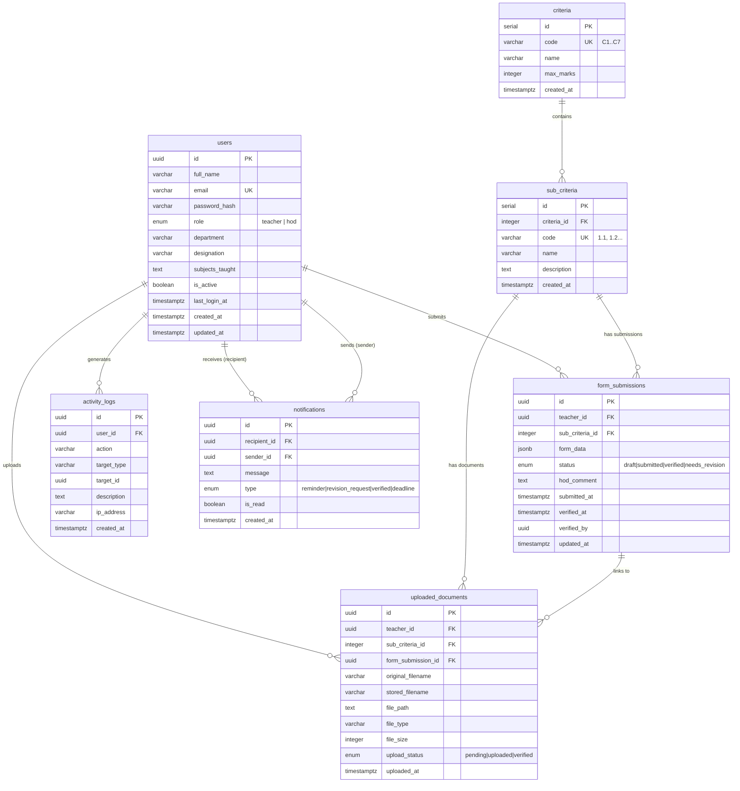

# NAAC FMS — Entity Relationship Diagram

## Database Schema Overview

## Table Relationships

| Parent Table | Child Table | Relationship | Foreign Key |
|-------------|-------------|-------------|-------------|
| `users` | `form_submissions` | 1:N | `teacher_id` |
| `users` | `uploaded_documents` | 1:N | `teacher_id` |
| `users` | `activity_logs` | 1:N | `user_id` |
| `users` | `notifications` | 1:N | `recipient_id` |
| `users` | `notifications` | 1:N | `sender_id` |
| `criteria` | `sub_criteria` | 1:N | `criteria_id` |
| `sub_criteria` | `form_submissions` | 1:N | `sub_criteria_id` |
| `sub_criteria` | `uploaded_documents` | 1:N | `sub_criteria_id` |
| `form_submissions` | `uploaded_documents` | 1:N | `form_submission_id` |

## Unique Constraints

- `users.email` — one account per email
- `criteria.code` — unique criterion code (C1-C7)
- `sub_criteria.code` — unique sub-criterion code (1.1, 2.1, etc.)
- `form_submissions(teacher_id, sub_criteria_id)` — one submission per teacher per sub-criterion

## Indexes

| Table | Index | Columns |
|-------|-------|---------|
| `form_submissions` | `idx_form_sub_teacher` | `teacher_id` |
| `form_submissions` | `idx_form_sub_subcriteria` | `sub_criteria_id` |
| `uploaded_documents` | `idx_doc_teacher` | `teacher_id` |
| `uploaded_documents` | `idx_doc_form_submission` | `form_submission_id` |
| `activity_logs` | `idx_log_user_id` | `user_id` |
| `activity_logs` | `idx_log_action` | `action` |
| `activity_logs` | `idx_log_created_at` | `created_at` |
| `notifications` | `idx_notif_recipient` | `recipient_id` |
| `notifications` | `idx_notif_type` | `type` |
